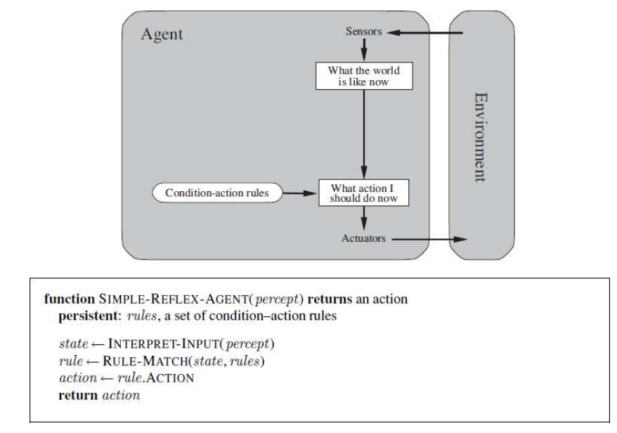
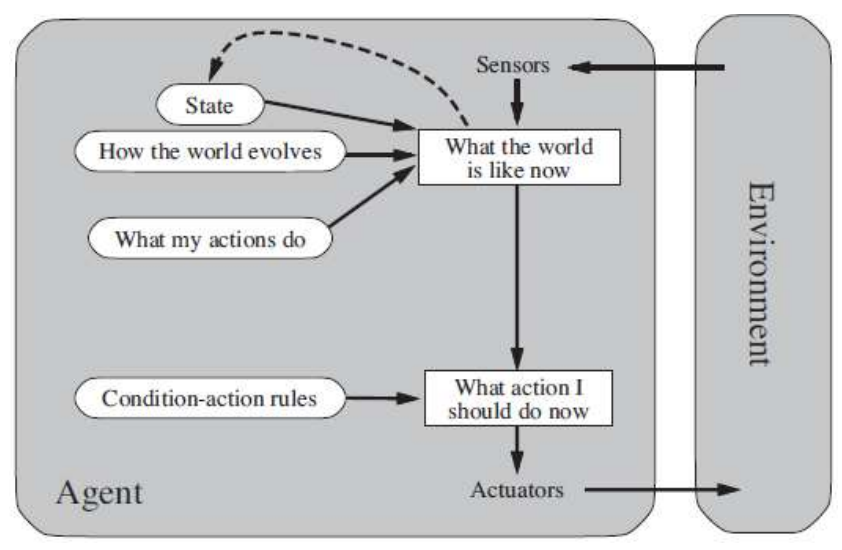
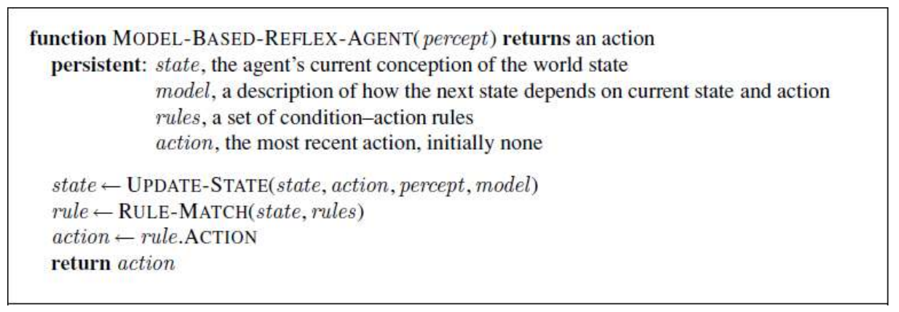
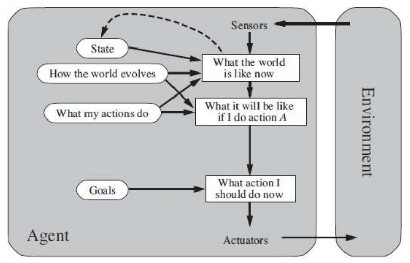
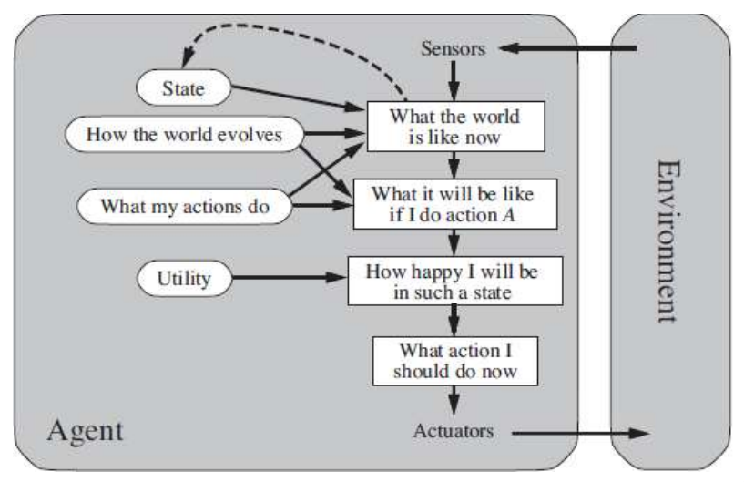
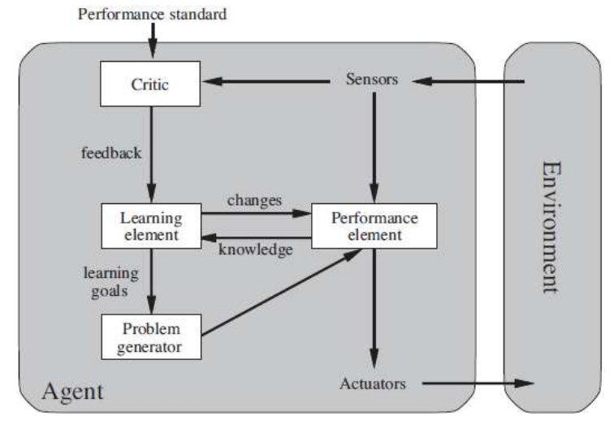
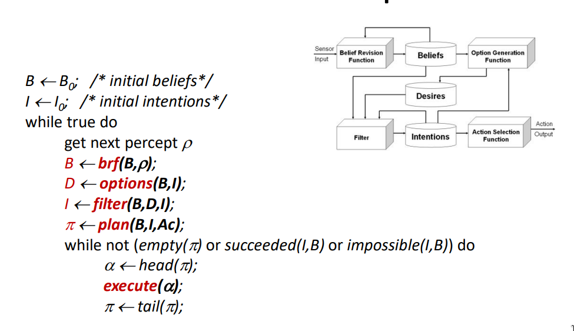

# Agent

In addition to the previous agent definitions, a **rational agent** selects the action expected to **maximize** its **performance measure** on it's **built-in knowledge** and historical sequence of perceptions. Mathematically: $f : P^* \rightarrow A$, where $P^*$ is the percept sequence and $A$ the action taken.

On top of that, **intelligent agents** need to have some properties:

- **Reactivity**: Respond in a timely fashion to changes that occur in the env, so that actions are not based on old env states
- **Proactiveness**: Exhibit goal-directed behavior by taking initiative
- **Social ability**: Interact with other agents (and possible humans ), we will see how in [[multi-agent_systems]]

# Environment

The inner design of the agent depends deeply on the nature and properties of the env, categorized in these dimensions:

- **Fully vs. Partially Observable**: Whether the agent has access to complete and accurate real-time data about the environment's state.
- **Single vs. Multi-Agent**: Whether other agents exist, and if their interaction is cooperative or competitive.
- **Deterministic vs. Stochastic**: Whether actions have completely certain, predetermined outcomes.
- **Episodic vs. Sequential**: Whether a current decision affects future choices.
- **Static vs. Dynamic**: Whether the environment changes on its own while the agent is deliberating.
- **Discrete vs. Continuous**: Whether there is a fixed, finite number of distinct actions and percepts.  

# Percepts to Actions

The following abstract agent architectures define **what** information an agent needs to process and map to actions, scaling from simple stimulus-response behaviors to full cognitive adaptability.

## Simple Reflex 

Select actions based only ***only*** on the current percept, mapping inputs directly using condition-action rules. This is **rigid** and *requires* **fully observable env** to work well.

## Model Based Reflex

Maintain an internal **state/model** tracking parts of the world that cannot be seen at the moment. Takes into account historical percepts and action effects.

## Goal Based

Combine state information with explicit goals describing desirable situations. The agent reasons about the future by searching and planning, flexible as changing goals alters course of action.

## Utility Based

Uses an internal **utility function** to determine how **"good"** specific states are. This is essential for navigating tradeoffs between conflicting goals ( like speed vs safety ) or weighting the likelihood of success in stochastic envs.
The **utility function** can encode goals, but with greater control, specifying various degrees of desirability instead of simply seeing them as binary ( completed or not )

## Learning Agents

A more complete system, that improves its behavior over time based on feedback from the environment. For that, it's split into 4 components:

- **Actor(performance element)**: chooses action
- **Critic**: evaluates actions based on an external performance standard ( because percept don't show success )
- **Problem Generator**: suggest exploratory actions and new experiences
- **Learning**: updates the model components to improve future success

# Architectural Philosophies

The bridge between theoretical abstraction and practical implementation can be done in different ways.

## Deductive Reasoning ( Symbolic AI )

Treat the agent as a logic-based theorem prover, by maintaining a database of logical beliefs about the environment. This maps both concepts and actions.

Deduction rules, as the name implies, is the process of selecting an action.

**Critique**: Highly elegant and clear math but theorem-proving is computationally slow and complex. For big systems, by the time a proof finishes a fast move world may have already changed, making the choice useless.

## Practical Reasoning ( BDI Model )

Modeled after human decision-making, divides reasoning into two phases: **Deliberation** ( what do achieve? ) | **Means-Ends Reasoning** ( how to achieve ? )

- **Beliefs**: knowledge/information about the world
- **Desires**: all conditions an agent wants to accomplish ( motivation )
- **Intentions**: the specific options the agent has actively committed to pursuing

#### BDI Control flow

- **Belief Revision Function**: Update beliefs with sensory inputs and previous beliefs
- **Option Generation**: Use belief and intention to generate desires
- **Filter**: Choose between desires and commit to its achievement (intentions)
- **Action Select**: Given current intention and belief generate plan of action

### Commitment 

Always regarding the agent knowledge and perspective.
- **Blind commitment**: until it's achieved
- **Single-minded commitment**: until achieved or no longer possible to achieve
- **Open-minded**: while still possible

**Reconsideration Trade-off**: Reconsidering too often and agents to nothing; Reconsidering too rarely wasts resources on impossible tasks. Must be **calibrated** to how fast the **env changes**.

## Reactive Agents

Difference between deductive. 

The idea that symbolic or abstract reasoning is not necessary for intelligence, as it is an **emergent property** born out of physical interaction with the world. 

Organized into an hierarchial stack of layers, each mapping sensor inputs directly to actions. Lower layers rule basic survival mechanisms and can **overwrite/suppress** the commands of higher, more abstract layers.

**Critique**: Excellent for real-time applications, because of fast almost instantaneous reactions. Because there is no world model, designing complex agents with many layers becomes hard and a process of trial-and-error, as the dynamic of layer interactions become unpredictable.

## Hybrid Agents

Practical systems often combine all this methodologies into hybrids, such as **Touring Machine** or **InteRPaP**.

# Mapping between those

The mapping between how a model tracks and encodes the information might not be clear, so this table might help.

| What is tracks                       | How it encodes                    | Mechanism                                                                                        |
| ------------------------------------ | --------------------------------- | ------------------------------------------------------------------------------------------------ |
| Simple Reflex                        | Reactive                          | Situation-action rules built directly into hierarchical layers                                   |
| Model-Based Reflex                   | Deductive Reasoning (Symbolic AI) | Explicit world tracking through a logical formula database ($\Delta$)                            |
| Goal-Based / Utility-Based           | Practical Reasoning (BDI)         | Deliberation maps to Desires; Tradeoff evaluation maps to Intentions                             |
| Learning Agent / All Complex Systems | Hybrid Architectures              | Layering Reactive philosophies (for reflex) with Deliberative philosophies (for planning/state). |