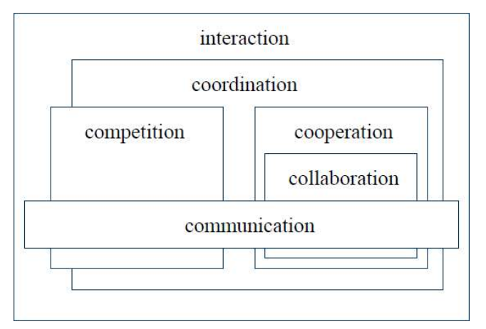
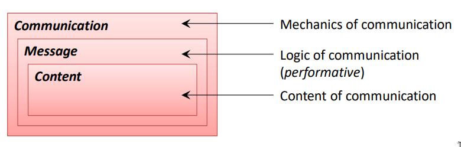

As we saw before, in **MAS**, multiple agents act on behalf of **distinct users** with differing goals and motivation. To achieve their design objectives they must have **social capacity** to **cooperate**, **coordinate** and **negotiate** with one another.

# Interaction

The interaction between agents can be divided into layers of escalating complexity.

1. **Communication**: The baseline mechanism to pass information
2. **Coordination**: How agents organize their tasks together
3. **Cooperation & Collaboration / Competition**: Specific dynamics depending on whether they have shared or opposing goals.

## Object Oriented Programming ( OOP )

Communication was already present in OOP, via **method invocation** for example, but in a different way, not so explicit ( in the way that was not marked/tagged as being communication ).

Object $o2$ communicates with object $o1$ by directly invoking $o1's$ public method. $o1$ has no control over the execution, the decision is totally enforced by $o2$

In **MAS**, agents are strictly **autonomous**. Agent $a2$ cannot enforce a method execution on $o1$ since each agent maintains complete control over their own internal state and behavior. Instead, $a2$ just asks(requests) $a1$ to perform an action, and $a1$ decides whether or not to comply.

*Mantra*: "Objects do it for free, agents do it for money"

# Speech Act Theory

Agent communication relies heavily on **Speech Act Theory**, (derived from Austin and Searle)which treats verbal utterances (anything that is said/communicated) as physical actions designed to change the state of the world. In fact, this is one of the main actions agents perform, communicating with others. 

### Speech Act

All speech has three main aspects

- **Locution**: The literal message sent
- **Illocution**: The intended meaning or sender true intention
- **Perlocution**: The resulting action, which is always subject to the receiver autonomy

Each speech act can also be divided into two parts:

- **Performative**: The verb used to distinguish between different **Illocution forces** ( inform, request, promise ...)
- **Propositional content**: What the speech is actually about

# Agent Communication Languages ( ACL )

These languages define how conversations between agents look like and must separate how the conversation **operates** from **what** the conversation is **about**, including two types of semantics:

- Communication protocol ( domain independent )
- Enclosed Message ( domain dependent )

## Main Frameworks

- **Knowledge Sharing Effort (KSE)**: an older effort consisting of KQML (which defined the message envelope and performative intent) and KIF (the content in first-order logic style).  
- **Foundation for Intelligent Physical Agents(FIPA)**: The modern **IEEE standard**, refining KQML.

# FIPA

A standard message wraps layers like an envelope:

- **Communication**: handles low level routing ( sender, receiver, reply-to ...)
- **Message**: establishes message intent via **performative** (independent of context) and tracks conversation flows using parameters like **protocol** and **conversation-id**
- **Content**: domain specific payload, bounded by its **language** and **ontology**

## Performatives and Semantics

The main performatives are **inform** and **request**, **FIPA** features a wide variety of other that are defined in terms of these two (agree, propagate, refuse, request etc...).

**FIPA ACL Semantics** ( define the meaning of the language ), define those performatives in the following way:

| Performative | Pre-Conditions                                                        | Rational Effect (goal)                                |
| ------------ | --------------------------------------------------------------------- | ----------------------------------------------------- |
| inform       | Sender believes its true and that receiver does not know              | Intent is to make receiver believe it to be true also |
| request      | Sender believes receiver can do it and has no intent already to do it | Intends receiver to do it                             |
|              |                                                                       |                                                       |

## Ontology 

If different AI systems want to share information, they need to agree on what words mean.
An ontology is a structured and precise description of a domain (things in it and how they relate), so everyone interprets it the same way.
These structures are usually written in special machine-readable formats like RDF or OWL so computers can process them automatically.

# Protocols 

Instead of isolated messages agents communicate using structured sequences of messages, called **interaction protocols**, such as **Contract Net**, **Request**, **Subscribe**

## Contract Net

The most fundamental protocol in multi-agent negotiation, mirroring real-world bidding structure.

1. **Announce**: Announces a task it needs executed
2. **Bid**: Responder Agent evaluates task and submits bids (eg. time it takes to perform )
3. **Assign**: Announcer compares bids and assigns task to best bidder
4. **Result**: Agent performs the task and send the finalized result back.

# MAS Platforms and Agent Oriented Software Engineering (OASE)

Building this systems is complex and it requires specific methodologies and platforms. 

- **JADE**: A popular FIPA-compliant platform
- **SPADE**: Smart Python Agent Development Environment that runs on top **XMPP** protocol as middleware for agent communication

