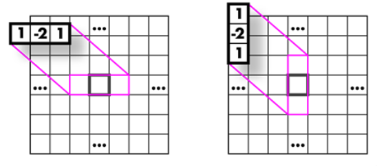
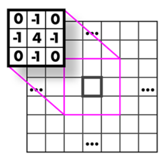
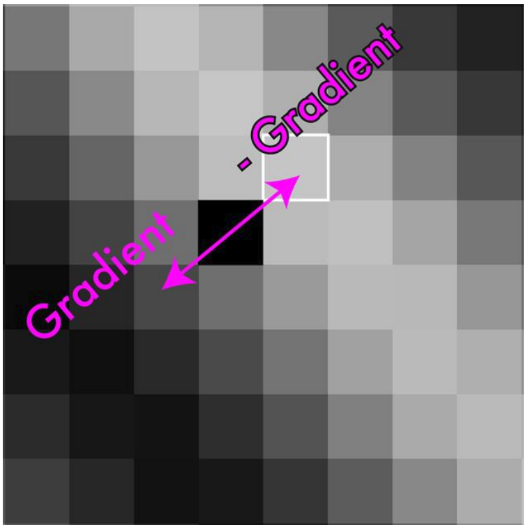

---

title: "Image Basics"
tags:
    - "vision"
    - "image processing"
draft: true
---

# From Sensor to Image
TODO: Evolution from sensor to rest

# How to store images?

Images are basically matrices of light. Each value equals the amount of light, called **pixels**.

An image can also be separated into color channels ( since light is composed by multiple frequencies ).

This way pixels we can ordered by row, column or channel.

## Row major

## Column major

## Channels interleaved HWC

## Channels separated CHW

> The best way to memorize the notation is to view it as iterating. (Ex: CHW, fix C loop, fix H loop W)

# Color Encodings

Besides the well known *RGB* there are also other ways to model the perception of light. One very usefull is ***HSV*** since it allows for very easy image transformation.

- **Hue**: what color
- **Saturation**: how much color
- **Value**: how bright