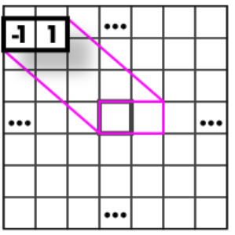
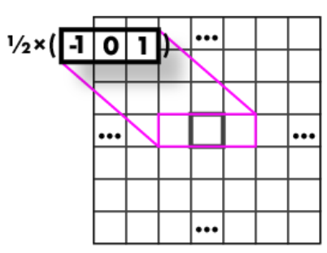

# What is an edge?

If we think of an image as a function an edge would be a rapid change of that function. If that were the case detecting edges could be done by using the derivative!

Because that is not the case, we need to estimate. Recall:

$$
    f'(x) = lim_{h->0}\frac{f(x+h) - f(x)}{h}
$$

How could this convert to a filter tho?

| h   | kernel                                    |
| --- | ----------------------------------------- |
| 1   |  |
| 2   |  |

Here an edge would be places where the absolute value is really high, indicating that there is a fast change in intensity.

#### Second derivative

We can apply a similar logic and consider the **second derivative**:

$$
    f''(x) = lim_{h->0}\frac{f(x+h) - 2f(x) + f(x-h)}{h^2} \\
$$

Here an edge would be places of ***zero-crossing*** indicating that the slop has changed direction, and often indicating an edge.

# Identify edges

As we saw, there are filters that can be applied to identify edges, but they only work in specific directions and are very sensitive to noise. 

## Gaussian smoothing

As we saw earlier in the [filtering] section, we can reduce noise in an image by applying certain filters, such as the ***Gaussian smoothing***.
Since convolution is associative, we can combine smoothing and edge detection into a single kernel.

### Sobel filter

### Laplacian of Gaussian LoG

## Check all directions

To fix this problem we have to somehow merge the two values, obtained by the filters in the x and y direction.
The best way is to use the **magnitude of gradient** for the first derivative and the **Laplacian** for the second.

$$
∥∇I∥=I_x^2​+I_y^2​
​
$$
$$
Laplacian = \frac{d^2f}{dx^2} + \frac{d^2f}{dy^2}
$$

# Difference of Gaussian

# Canny Edge Detection

A complete algorithm to define lines of an image:

1. Smooth image ( only obtain real edges and not noise )
2. Calculate gradient direction and magnitude
3. Non-maximum suppression perpendicular to edge
4. Threshold into strong, weak, no edge
5. Connect together components

## Non-maximum suppression 

This step is important to make lines only a pixel thick and very thin.
For this we have to analyze the nearby pixels, in the direction of the gradient ( perpendicular to the edge ), and keep only the one with highest gradient magnitude.

$$
    ang = arctan(\frac{I_y}{I_x})
$$

## Threshold edges & Connect

The result of the previous step will naturally result on some detected edges being stronger than others. A weak edge is naturally less probable of being a real edge.

For this 2 thresholds are used and 3 cases:

- R > T: strong edge
- R < T but R > t: weak edge
- R < t: no edge

Next step is connecting some of the edges:

- Strong edges are edges
- Weak edges are edges *iff* they connect to strong edges ( k neighbors )

This approach fixes the problem of a single threshold, where an edge having some of its parts below the defined value, and other above, which would create a lot of individual small edges.

# Edges to Lines

With this we got an image of a very well defined edges. But how to actually get the information about the line outside the image? 

