Image transformations can be divided into two categories:

- **Filtering**: Change pixel values
- **Warping**: Change pixel locations

**Filtering** can be applied individually to each pixel ***Point Processing*** or as a ***Neighborhood Operation*** which is more powerfull.

## Point Processing

A function is applied to each pixel value to generate another. 
This functions can be of different natures ( linear, non-linear, etc... )

| Operation                 | Function                     |
| ------------------------- | ---------------------------- |
| Original                  | X                            |
| Invert                    | 255 - x                      |
| Darken                    | x - 128                      |
| Lighten                   | x + 128                      |
| Lower Contrast            | x / 2                        |
| non-linear lower contrast | $\frac{x}{255}^{1/3} * 255 $ |
| Raise contrast            | x * 2                        |
| non-linear raise contrast | $\frac{x}{255}^{2} * 255 $   |

### Histograms

Count the number of pixels that have that certain caracteristic.

**Enchance contrast in dark regions**

| Function | Before                             | After                              |
| -| ---------------------------------- | ---------------------------------- |
|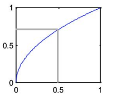 | 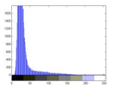 | 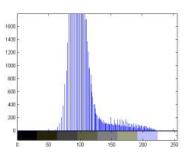 |

**Enchance contrast in bright regions**

| Function | Before                             | After                              |
| -| ---------------------------------- | ---------------------------------- |
|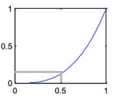 | 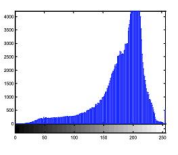 | 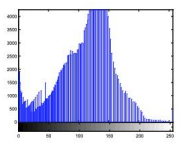 |

> A nice way to understand this is to realize that the stepper the curve the more difference would be between the output values. That way, separating them

#### Equalization

Improve image contrast by redistributing pixel intensities by mapping old to new ones, spreading them over the full possible range.

| Before | After |
| ------ | ----- |
|  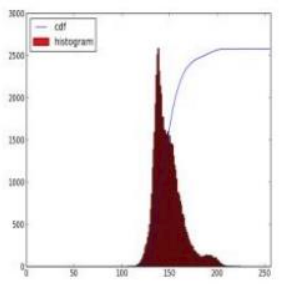  | 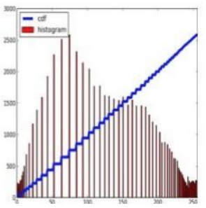       |

After equalization the cumulative distribution function (running sum ) is almost linear.

### CLAHE - Contrast Limited Adaptive Histogram Equalization

For some images, specific areas might require specific treatment. This method aims to solve that:

- Divide the image into MxM pixel non-overlapped sub-blocks
- Perform histogram equalization on each
- To avoid visible discontinuity between blocks smooth the functions between blocks
- CLAHE =   AHE + contrast limiting

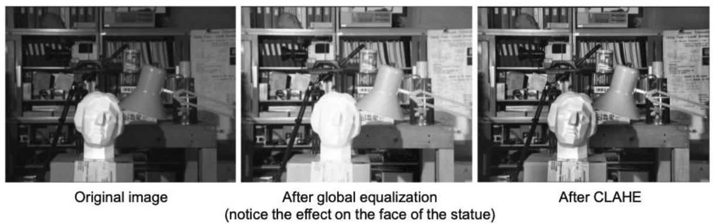

# Filtering

The idea is to also apply operations that change the pixel values but, in this case, while considering the surrounding pixels, which allows for more advanced transformations.

**The idea**:
- Slide a ***kernel*** ( filter mask | window | convolution matrix ), basically a matrix of numbers, along the image
- At each position, apply that matrix, by multiplying its values with the pixels and summing everything
- The center pixel gets a new value, the result of that calculation

This process is called ***convolution***

## Kernel examples

Original Image: 
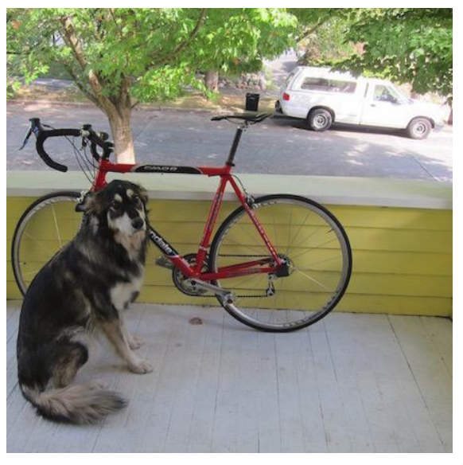

| Effect                     | Matrix                                                                                                                                                                 | Explanation                                                                                                                                                                             | Result |
| -------------------------- | ---------------------------------------------------------------------------------------------------------------------------------------------------------------------- | --------------------------------------------------------------------------------------------------------------------------------------------------------------------------------------- | ------ |
| Identity                   | $\begin{bmatrix} 0 & 0 & 0 \\ 0 & 1 & 0 \\ 0 & 0 & 0 \end{bmatrix}$                                                                                                    | Just the middle number considered                                                                                                                                                       |        | Same image
| Box Average                | $\frac{1}{9}\begin{bmatrix} 1 & 1 & 1 \\ 1 & 1 & 1 \\ 1 & 1 & 1 \end{bmatrix}$                                                                                         | Average of all pixels, flatting out differences                                                                                                                                         |       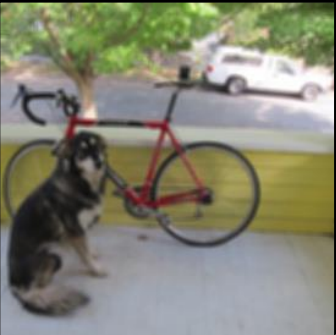 |
| Highpass or Edge Detection | $$\begin{bmatrix} 0 & 1 & 0 \\ 1 & -4 & 1 \\ 0 & 1 & 0 \end{bmatrix} \quad \text{or} \quad \begin{bmatrix} -1 & -1 & -1 \\ -1 & 8 & -1 \\ -1 & -1 & -1 \end{bmatrix}$$ | **Sums to zero**. In areas where pixel intensities are constant output is zero. If there's a sharp difference between the pixel and the boundary, output is not zero, lighting the area | 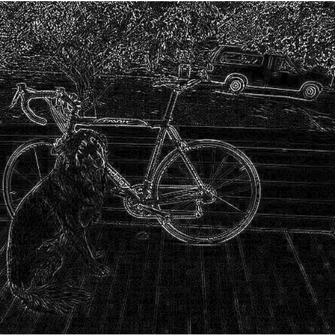        |
| Sharpen                    | $$\begin{bmatrix} 0 & -1 & 0 \\ -1 & 5 & -1 \\ 0 & -1 & 0 \end{bmatrix}$$                                                                                              | Highpass + Identity to only highlight the boundaries without removing information                                                                                                       |  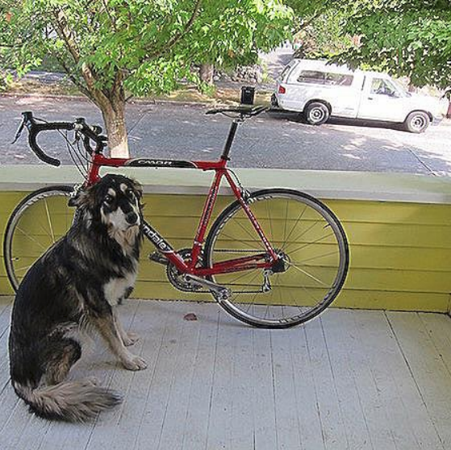|
| Emboss                     | $$\begin{bmatrix} -2 & -1 & 0 \\ -1 & 1 & 1 \\ 0 & 1 & 2 \end{bmatrix}$$                                                                                               | Calculates difference between diagonal axis, mimicking directional lighting giving a carved look                                                                                        |  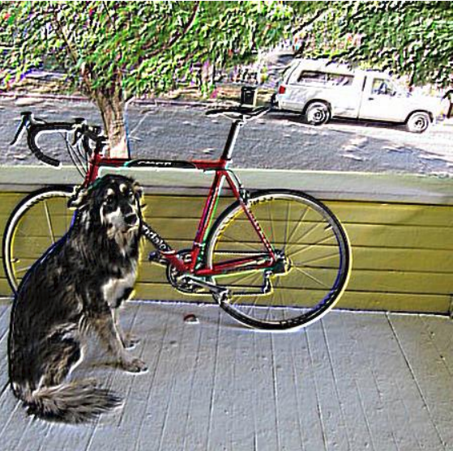|
| Sobel                      | $$\begin{bmatrix} -1 & 0 & 1 \\ -2 & 0 & 2 \\ -1 & 0 & 1 \end{bmatrix} \quad \text{and} \quad \begin{bmatrix} -1 & -2 & -1 \\ 0 & 0 & 0 \\ 1 & 2 & 1 \end{bmatrix}$$   | Subtract one side from another (derivative) and smooth by giving more weight to center                                                                                                  |     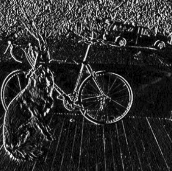 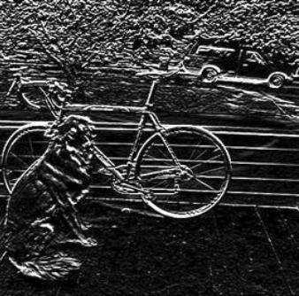|

# Noise

Noise is in essence simply unwanted disturbance in images.

**Salt & Pepper**: noise has min/max value
**Gausian**: grainy textures, no extreme spikes

### Median Filters

Not a **convolution** filter as it cannot be applied with the same mathematical process. Works by selecting the median intensity in the window, and works perfectly to eliminate **salt & pepper** noise.

