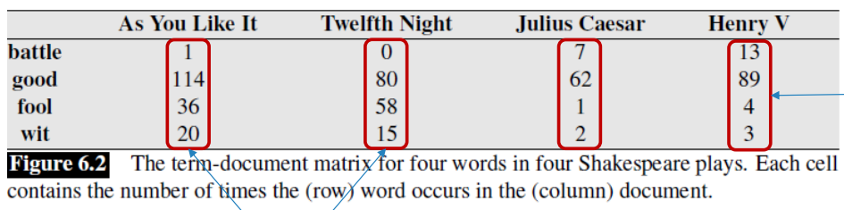
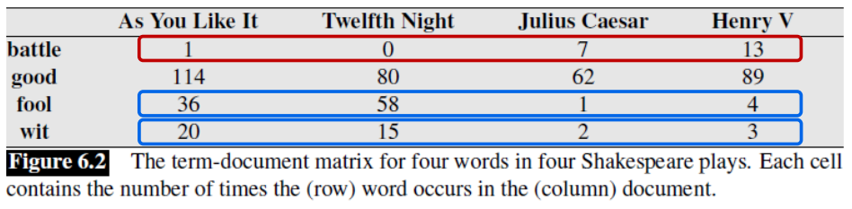
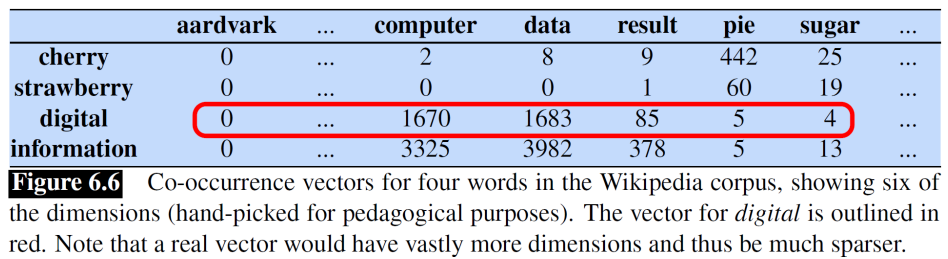
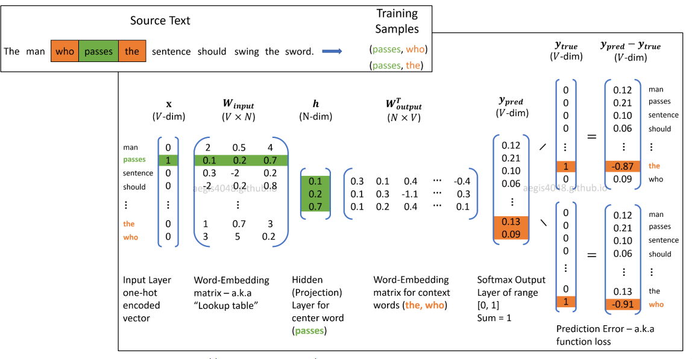

We saw before in [[preprocessing]] how we can divide a text into tokens and in [[text-classification]] how to represent a text considering the appearance of those tokens.
Now we will explore how those representation might be missing something and what other ways we can represent a document.

# How to represent words?

This was not very explored before, but a simple representation might be:

- **Symbolic Representation ( Unigrams )**: purely as string of characters 'cat' = C-A-T 
- **One-Hot Vectors (Localist Representation)**: vector of length == size vocab, with each index for a specific word. 'cat' = [0, 0, ..., 1, 0, ...]

The problem is that we want computers to understand the relationship between words as humans do. With this representation even synonyms would be **orthogonal** vectors.

# Lexical Semantics

To understand exactly which properties we want our word representation to have we should understand what properties and relationships could exist between words and their meanings (senses):

- **Polysemy**: single word, multiple senses
- **Synonym**: words that are substitutable without changing its true meaning. No two words are absolutely identical in meaning tho
- **Hypernym/Hyponym**: "Is-a" hierarchies ( meal is hyper of breakfast)
- **Meronym/Holonym**: Part-to-whole relationships (leg is meronym of table)
- **Similarity**: if words share definition/type (cat/dog)
- **Relatedness**: belong to the same semantic field but are not the same (coffe/cup)
- **Connotation**: affective/emotional mapping 

How could machines ever understand this?

# Distributional Hypothesis

*"Words that occur in similar contexts tend to have similar meanings"*

If we read the sentences "Ongchoi is delicious sauteed with garlic" and "Spinach is delicious sauteed with garlic", we can infer that Ongchoi is a leafy green vegetable similar to spinach, purely by looking at its neighboring context words.

Many techniques were used for text representation, all following this idea.

# Sparse Vectors

As we saw before, in [[text-classification]], we can use TF-IDF as replacement for simple counts.

## Document
With this we can create a **Term-Document Matrix**, where each row is a vector that describes the word, and each column a vector that describes the document.

Considering the **distributional hypothesis** described before, we can already obtain some information. Similar documents tend to have similar words, and similar words tend to appear in similar documents.

## Context

For better understanding the relationship between words we can analyze the context(surrounding) words of a specific **target** counting how many times each word appears in that context.
Two words are **very similar** if their **context vectors are similar**

Now that each word is defined by a vector we can measure the similarity between them by calculating the **dot product**. 

- High when vectors have large values in the same direction
- To avoid favoring long vectors use $cos(\theta)=\frac{a . b}{|a||b|}$ so result is normalized

# Dense Vectors

While TF-IDF vectors are long and full of zeros (sparse), embeddings are short (50–1000 dimensions) and mostly non-zero (dense). Dense vectors perform better across all NLP tasks because they capture synonyms more effectively.

## word2vec

Introduced by Mikolov, uses raw text for a self-supervised classification problem. It trains a binary classifier to predict whether a word is likely to occur near a target word. Having two main architectures:

- **Continuous Bag of Words(CBOW)**: Input are the context words, try to predict target
- **Skip-gram**: Input is the target word, try to predict surrounding

The end goal is not the prediction task, we want to then use the learned **classifier weights** as the **word embeddings**.

### Negative Sampling

In this approach its necessary to use **softmax** as activation function so that all the outputs sum up to 1, which is very expensive. So, **Negative Sampling** can avoid that:

1. Treat the target word and a neighboring context word as positive examples
2. Randomly sample other words in the lexicon to get negative samples
3. Use logistic regression to train a binary classifier to distinguish those two cases
4. Use the learned weights as the embeddings.

> Because every word is inputs as both target and context, they have 2 embeddings. They can be added or the context one thrown away

Basically, the steps change to this:

1. Inputs are now pairs of words, target + neg/pos, each one-hot encoded separately
2. Calculate weights for each input, as before
3. Calculate dot product of them and apply **sigmoid**

# Properties of embeddings 

### Size of context window

**Smaller windows** lead to more **syntactic representations**: semantically similar words tend to have the same POS
**Wider windows** lead to topically **related**, not necessarily **similar**

### Analogy

The ability to capture **relational mappings**

king - man + woman = queen
Paris - France + Italy = Rome

### Bias

Naturally embeddings learn and reproduce the **implicit biases and stereotypes** that are latent in the text.